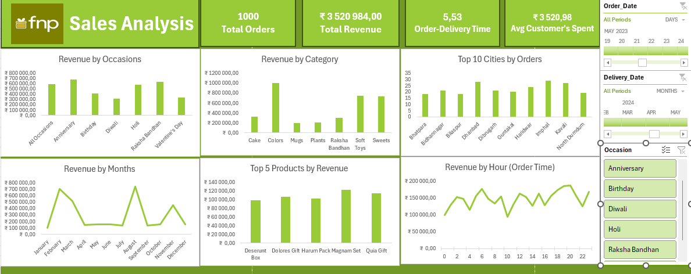

# FNP Sales Analysis Dashboard

This project presents a comprehensive sales performance dashboard for Ferns N Petals (FNP), built using Excel's advanced data tools—Power Query, Power Pivot, and data modeling. It explores customer behavior, product trends, and seasonal patterns to support strategic decision-making.

## Dashboard Highlights

- **Summary Metrics**:
  - Total Orders: 1,000
  - Total Revenue: ₹3,520,984.00
  - Avg Customer Spend: ₹3,520.98
  - Order-Delivery Time: 5.53 days

- **Revenue Breakdown**:
  - By Occasion: Raksha Bandhan, Diwali, Holi, Birthday, Anniversary
  - By Category: Cakes, Chocolates, Mugs, Plants, Soft Toys, Flowers
  - By Month: Monthly revenue trends from May 2021 to April 2022
  - By Hour: Hourly distribution of order revenue

- **Top Performers**:
  - Cities: Top 10 cities by order volume
  - Products: Top 5 products by revenue (e.g., Black Forest, Golden Gift, Mix Roses Bouquet)

- **Interactive Filters**:
  - Order Date and Delivery Date ranges
  - Occasion-based filtering

## 🛠 Tools & Techniques

- **Power Query**: Data cleaning, transformation, and automation
- **Power Pivot**: Relationship modeling and calculated metrics using DAX
- **Excel Visualizations**: Dynamic charts, slicers, and formatting for clarity

## Dashboard Preview

## 🚀 Purpose

This dashboard demonstrates how Excel can replicate Power BI-style analytics using built-in tools. It serves as a practical example of combining data modeling with visual storytelling for business insights.

